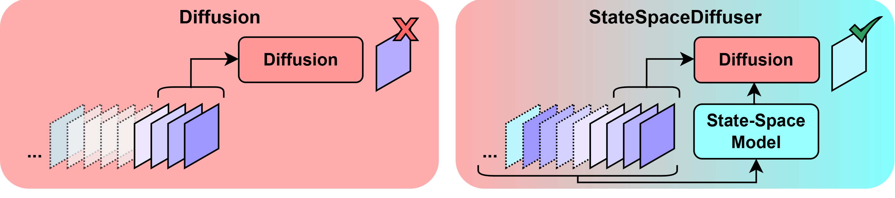

# StateSpaceDiffuser

This is the official repository of <b>StateSpaceDiffuser: Bringing Long Context to Diffusion World Models, NeurIPS'25</b>.

 
<!--   -->

Authors: [Nedko Savov](https://insait.ai/nedko-savov/), [Naser Kazemi](https://naser-kazemi.github.io/), [Deheng Zhang](https://insait.ai/deheng-zhang/), [Danda Pani Paudel](https://insait.ai/dr-danda-paudel/), [Xi Wang](https://xiwang1212.github.io/homepage/), [Luc Van Gool](https://insait.ai/prof-luc-van-gool/)

<!-- 
Keywords: world model, long context, state-space model, Mamba, diffusion.
-->

StateSpaceDiffuser merges a state-space model for memory with a diffusion model for detailed visuals, allowing it to produce stable long-term video predictions. It tackles the challenge of drift in world models over extended rollouts. The approach achieves temporally consistent visual generation across both 2D and 3D interactive environments, significantly outperforming diffusion-only baseline in long-horizon tasks. Expect the code here soon!
